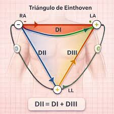
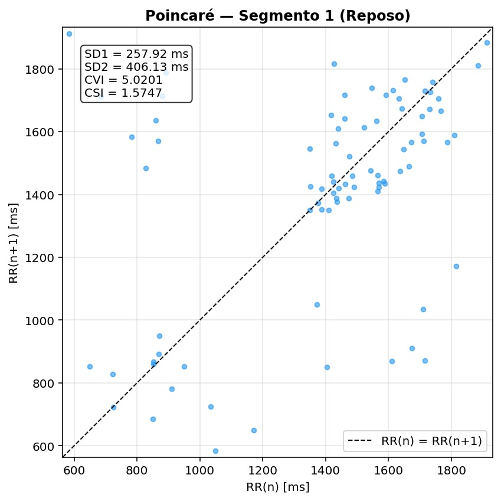
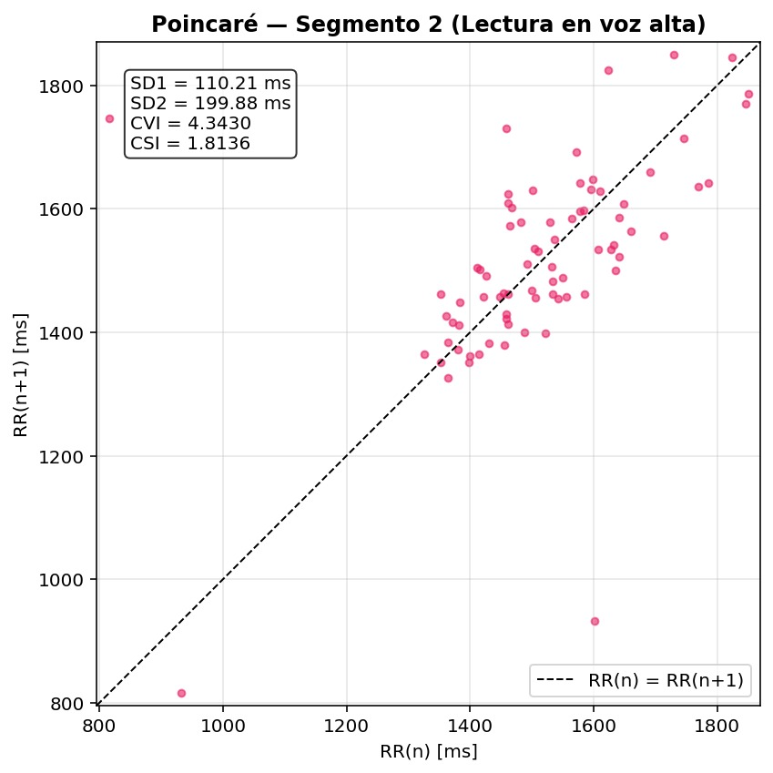

# LABORATORIO-5
# VARIABILIDAD DE LA FRECUENCIA CARDIACA (HRV) Y BALANCE AUTONOMICO
En esta practica vamos a analizar la variabilidad de la frecuencia cardíaca (HRV) como un indicador del balance entre la actividad simpática y parasimpática del sistema nervioso autónomo. Para ello, se adquirimos una señal ECG real en dos condiciones fisiológicas diferentes (reposo y lectura en voz alta), se procesa digitalmente mediante filtrado, detección de picos R y cálculo de intervalos R-R, y finalmente se estudia la HRV tanto en el dominio del tiempo como mediante el diagrama de Poincaré, permitiendo obtener índices cuantitativos de actividad simpática y vagal. La práctica integra conceptos de fisiología, adquisición de señales y procesamiento digital.

## objetivos 
- Identificar cambios en el balance autonómico mediante análisis temporal de la variabilidad de la frecuencia cardíaca (HRV).
- Analizar la variabilidad de la frecuencia cardíaca (HRV) como herramienta para evaluar el balance autonómico.
- Adquirir y procesar correctamente una señal ECG utilizando métodos de filtrado y detección de picos R.
- Comparar la respuesta autonómica del sujeto entre reposo y lectura en voz alta.
- Aplicar herramientas de análisis temporal y no lineal (diagrama de Poincaré) para caracterizar la HRV.
- Interpretar resultados fisiológicos relacionados con actividad simpática y parasimpática.

## PARTE A 
<br>


## 𝘼𝙘𝙩𝙞𝙫𝙞𝙙𝙖𝙙 𝙎𝙞𝙢𝙥𝙖𝙩𝙞𝙘𝙖 𝙮 𝙋𝙖𝙧𝙖𝙨𝙞𝙢𝙥𝙖𝙩𝙞𝙘𝙖 𝙙𝙚𝙡 𝙨𝙞𝙨𝙩𝙚𝙢𝙖 𝙣𝙚𝙧𝙫𝙞𝙤𝙨𝙤 𝙖𝙪𝙩𝙤𝙣𝙤𝙢𝙤
El cuerpo humano mantiene un equilibrio constante entre los estados de actividad y reposo gracias al sistema nervioso autónomo, encargado de controlar funciones involuntarias como la respiración, el ritmo cardíaco y la digestión. Este sistema se divide en el sistema nervioso simpático y el sistema nervioso parasimpático, que trabajan de forma complementaria.<br>

El sistema nervioso simpático prepara al organismo para situaciones de alerta o estrés, aumentando la frecuencia cardíaca, dilatando las pupilas y proporcionando mayor energía al cuerpo. Por otro lado, el sistema nervioso parasimpático favorece los estados de descanso y recuperación, disminuyendo el ritmo cardíaco, estimulando la digestión y ayudando a conservar energía. Gracias a la acción coordinada de ambos sistemas, el cuerpo puede mantener su estabilidad y funcionamiento adecuado.<br>

<br>
El sistema nervioso simpático es el encargado de activar y acelerar las funciones del organismo, preparando al cuerpo para responder ante situaciones de peligro, estrés o emergencia. Se relaciona con la conocida respuesta de “lucha o huida”, ya que permite que la persona reaccione rápidamente frente a estímulos que requieren una acción inmediata.<br>

Cuando este sistema se activa, produce diferentes cambios fisiológicos en el cuerpo, como el aumento de la frecuencia cardíaca y respiratoria, la elevación de la presión arterial y la dilatación de las pupilas. Además, redistribuye el flujo sanguíneo, enviando mayor cantidad de sangre hacia el cerebro, el corazón y los músculos, mientras disminuye el aporte hacia órganos como el estómago y los intestinos. Gracias a estas respuestas, el organismo obtiene más energía y capacidad de reacción para enfrentar situaciones de alta demanda física o emocional.<br>

<br>
El sistema nervioso parasimpático es el encargado de promover el estado de relajación, descanso y recuperación del organismo después de situaciones de actividad o estrés. Su función principal es conservar y restaurar la energía del cuerpo, favoreciendo el mantenimiento de las funciones normales y el equilibrio interno del organismo.<br>

Cuando este sistema se activa, produce una disminución de la frecuencia cardíaca y respiratoria, reduce la presión arterial y favorece procesos como la digestión y la absorción de nutrientes. Además, estimula la actividad del estómago y los intestinos, permitiendo que el cuerpo entre en un estado de reposo y recuperación. Gracias a la acción del sistema nervioso parasimpático, el organismo puede recuperar energía, mantener la estabilidad de sus funciones vitales y favorecer el bienestar general.<br>


<br>
La actividad del sistema nervioso simpático y parasimpático tiene un efecto directo sobre la frecuencia cardíaca, ya que ambos regulan el funcionamiento del corazón de manera opuesta y complementaria.<br>

El sistema nervioso simpático aumenta la frecuencia cardíaca al preparar al organismo para situaciones de alerta, estrés o actividad física. Esto ocurre porque estimula al corazón para que lata más rápido y con mayor fuerza, permitiendo que llegue más sangre y oxígeno a los músculos y órganos que necesitan responder rápidamente.<br>

Por otro lado, el sistema nervioso parasimpático disminuye la frecuencia cardíaca, favoreciendo estados de reposo y recuperación. Su acción ayuda a que el corazón lata más lentamente, reduciendo el gasto de energía y permitiendo que el organismo mantenga un estado de calma y equilibrio.
Gracias a la interacción de ambos sistemas, el cuerpo puede adaptar la frecuencia cardíaca según las necesidades del momento, manteniendo un adecuado funcionamiento del organismo.<br>

<br>
La variabilidad de la frecuencia cardíaca (HRV) es la variación en el tiempo que existe entre un latido cardíaco y el siguiente. Esta se obtiene a partir de la señal electrocardiográfica (ECG), mediante el análisis de los intervalos R-R, que corresponden al tiempo entre picos consecutivos de la onda R. La HRV es considerada un indicador importante del funcionamiento del sistema nervioso autónomo, ya que refleja el equilibrio entre la actividad simpática y parasimpática.<br>

Una HRV alta suele asociarse con un predominio de la actividad parasimpática, indicando un buen estado de adaptación, relajación y recuperación del organismo. En cambio, una HRV baja se relaciona con una mayor actividad simpática, asociada a situaciones de estrés, fatiga o sobrecarga física y emocional. Por esta razón, el análisis de la HRV es ampliamente utilizado en áreas clínicas, deportivas y de investigación para evaluar el estado cardiovascular y el nivel de estrés del cuerpo.<br>

<br>
El diagrama de Poincaré es una representación gráfica utilizada para analizar la variabilidad de la frecuencia cardíaca (HRV) a partir de la serie de intervalos R-R obtenidos del electrocardiograma (ECG). En este diagrama, cada intervalo R-R se grafica en función del intervalo siguiente, permitiendo observar de manera visual el comportamiento y la variabilidad de los latidos cardíacos.<br>

La forma y distribución de los puntos proporcionan información sobre el equilibrio del sistema nervioso autónomo. Una nube de puntos más amplia y alargada suele indicar una mayor variabilidad cardíaca y un predominio parasimpático, asociado a relajación y buena adaptación del organismo. Por el contrario, una distribución más compacta puede reflejar menor variabilidad y predominio simpático, relacionado con estrés o fatiga. Debido a esto, el diagrama de Poincaré es una herramienta útil para evaluar el estado cardiovascular y la regulación autónoma del corazón.<br>
## Toma de la señal
Para la extracción de la señal ECG, se tomo como referencia el triangulo de Einthoven



## PARTE B 
Con el fin de realizar el análisis de la variabilidad de la frecuencia cardíaca (HRV), la señal electrocardiográfica adquirida fue sometida a una etapa de pre-procesamiento digital orientada a reducir el ruido y mejorar la identificación de los complejos QRS. Para ello, se diseñó e implementó un filtro digital IIR tipo Butterworth pasa banda, capaz de atenuar las componentes de baja frecuencia asociadas a la deriva de línea base y las componentes de alta frecuencia relacionadas con ruido muscular e interferencias eléctricas.<br>

Posteriormente, la señal filtrada fue segmentada en dos intervalos de dos minutos correspondientes a los estados de reposo y lectura, permitiendo comparar la actividad cardíaca bajo diferentes condiciones fisiológicas. A partir de estos segmentos se identificaron los picos R del ECG y se calcularon los intervalos R-R, los cuales constituyen la base para el análisis de la variabilidad cardíaca en el dominio del tiempo.<br>


### Codigo
```
import numpy as np
import matplotlib.pyplot as plt
from scipy.signal import butter, lfilter

data = np.loadtxt('AlejandraECG.txt')

# ECG REAL -> columna 5
ecg = data[:,5]

ecg = ecg - np.mean(ecg)
Fs = 500
```
Este fragmento del código importa las librerías. Luego, carga los datos desde el archivo AlejandraECG.txt y selecciona la columna 5, correspondiente a la señal de ECG real. Después, elimina el valor promedio de la señal para centrarla alrededor de cero y finalmente define la frecuencia de muestreo en 500 Hz, que indica cuántas muestras por segundo fueron tomadas.
```
fc1 = 0.5
fc2 = 40

low = fc1 / (Fs/2)
high = fc2 / (Fs/2)
orden = 4

b, a = butter(
    orden,
    [low, high],
    btype='band'
)
ecg_filtrada = lfilter(b, a, ecg)

t = np.arange(len(ecg)) / Fs
muestras = 4 * 60 * Fs
plt.figure(figsize=(16,10))

plt.subplot(2,1,1)

plt.plot(
    t[:muestras],
    ecg[:muestras],
    linewidth=0.7
)
```
En esta parte del código se definen las frecuencias de corte del filtro pasa banda, entre 0.5 Hz y 40 Hz, para conservar únicamente las frecuencias importantes del ECG y eliminar ruido o interferencias. Luego, las frecuencias se normalizan respecto a la frecuencia de muestreo y se diseña un filtro Butterworth de orden 4. Después, el filtro se aplica a la señal ECG usando `lfilter`, obteniendo la señal filtrada. Finalmente, se crea el vector de tiempo y se prepara la gráfica de los primeros 4 minutos de la señal original para su visualización.

```
plt.title('Señal ECG Original (cruda)')
plt.xlabel('Tiempo [s]')
plt.ylabel('Amplitud')
plt.grid()
plt.subplot(2,1,2)
plt.plot(
    t[:muestras],
    ecg_filtrada[:muestras],
    linewidth=0.7
)

plt.title('Señal ECG Filtrada')
plt.xlabel('Tiempo [s]')
plt.ylabel('Amplitud')
plt.grid()

plt.tight_layout()
plt.show()
```
En esta sección se configuran y muestran las gráficas de la señal ECG original y la señal filtrada. Primero, se añaden títulos, nombres de ejes y cuadrícula a la gráfica de la señal cruda. Luego, en una segunda subgráfica, se representa la señal ECG después del filtrado para comparar cómo se redujo el ruido y se mejoró la calidad de la señal. Finalmente, `tight_layout()` organiza automáticamente las gráficas para evitar superposiciones y `show()` muestra la figura completa en pantalla.<br>

<br>
En las gráficas se observa la comparación entre la señal ECG original y la señal filtrada. La primera presenta más variaciones y componentes de ruido, mientras que la señal filtrada muestra una forma más limpia y estable, conservando los picos principales del ECG. Esto indica que el filtro pasa banda aplicado logró reducir interferencias y frecuencias no deseadas, mejorando la calidad de la señal para su posterior análisis.<br>

### Filtro 
<br>
<br>

#### Pre-Procesamiento 
```
# SEGMENTOS DE 2 MINUTOS
dos_min = 2 * 60 * Fs
reposo = ecg_filtrada[0:dos_min]
lectura = ecg_filtrada[dos_min:2*dos_min]

# DETECCIÓN DE PICOS R
from scipy.signal import find_peaks
peaks_r_reposo, _ = find_peaks(
    reposo,
    distance=0.5*Fs,
    prominence=np.std(reposo)
)
peaks_r_lectura, _ = find_peaks(
    lectura,
    distance=0.5*Fs,
    prominence=np.std(lectura)
)

```
En esta sección, la señal ECG filtrada se divide en segmentos de 2 minutos para analizar diferentes estados de la señal. Luego, utilizando la función `find_peaks`, se detectan los picos R tanto en el segmento de reposo como en el de lectura. Para ello, se establece una distancia mínima entre picos de 0.5 segundos y una prominencia basada en la desviación estándar de la señal, permitiendo identificar de manera más precisa los latidos cardíacos principales.<br>

```
# INTERVALOS R-R
RR_reposo = np.diff(peaks_r_reposo) / Fs
RR_lectura = np.diff(peaks_r_lectura) / Fs

# TIEMPO RR
t_rr_reposo = peaks_r_reposo[1:] / Fs
t_rr_lectura = peaks_r_lectura[1:] / Fs

# GRÁFICAS PICOS R

plt.figure(figsize=(16,10))

# REPOSO
plt.subplot(2,1,1)
plt.plot(reposo)
plt.plot(
    peaks_r_reposo,
    reposo[peaks_r_reposo],
    'ro'
)
plt.title('Detección de Picos R - Reposo')
plt.xlabel('Muestras')
plt.ylabel('Amplitud')
plt.grid()
```
En esta parte del código se calculan los intervalos R-R, que corresponden al tiempo entre un latido y el siguiente, tanto para el estado de reposo como para el de lectura. Luego, se obtiene el tiempo asociado a cada intervalo para facilitar su análisis temporal. Finalmente, se genera una gráfica de la señal en reposo y se resaltan los picos R detectados con puntos rojos, permitiendo visualizar de forma clara la ubicación de cada latido cardíaco identificado.<br>

```
# LECTURA
plt.subplot(2,1,2)
plt.plot(lectura)
plt.plot(
    peaks_r_lectura,
    lectura[peaks_r_lectura],
    'ro'
)
plt.title('Detección de Picos R - Lectura')
plt.xlabel('Muestras')
plt.ylabel('Amplitud')
plt.grid()
plt.tight_layout()
plt.show()

# GRÁFICAS RR
plt.figure(figsize=(16,8))

```
En esta sección se grafica la señal correspondiente al estado de lectura junto con los picos R detectados, marcados en color rojo para identificar visualmente cada latido cardíaco. Después, se añaden títulos, etiquetas y cuadrícula para facilitar la interpretación de la gráfica. Finalmente, `tight_layout()` organiza correctamente las subgráficas y se crea una nueva figura destinada a representar posteriormente los intervalos R-R calculados.

```
# RR REPOSO
plt.subplot(2,1,1)
plt.plot(
    t_rr_reposo,
    RR_reposo
)

plt.title('Intervalos R-R - Reposo')
plt.xlabel('Tiempo [s]')
plt.ylabel('Intervalo R-R [s]')
plt.grid()
plt.subplot(2,1,2)

plt.plot(
    t_rr_lectura,
    RR_lectura
)
plt.title('Intervalos R-R - Lectura')
plt.xlabel('Tiempo [s]')
plt.ylabel('Intervalo R-R [s]')
plt.grid()
plt.tight_layout()
plt.show()
```
En esta parte del código se grafican los intervalos R-R obtenidos para los estados de reposo y lectura. La primera subgráfica muestra cómo varía el tiempo entre latidos durante el reposo, mientras que la segunda representa los intervalos durante la lectura. Estas gráficas permiten analizar la variabilidad de la frecuencia cardíaca y comparar los cambios en el ritmo cardíaco entre ambas condiciones.<br>

```
# MEDIA RR
media_rr_reposo = np.mean(RR_reposo)
media_rr_lectura = np.mean(RR_lectura)

# DESVIACIÓN ESTÁNDAR (SDNN)
sdnn_reposo = np.std(RR_reposo)
sdnn_lectura = np.std(RR_lectura)

# RESULTADOS
print('========= REPOSO =========')
print(f'Media RR: {media_rr_reposo:.4f} s')
print(f'SDNN: {sdnn_reposo:.4f} s')

print('\n========= LECTURA =========')
print(f'Media RR: {media_rr_lectura:.4f} s')
print(f'SDNN: {sdnn_lectura:.4f} s')
```
En esta sección del código se calculan parámetros estadísticos de los intervalos R-R para analizar el comportamiento del corazón en reposo y durante la lectura. Primero, se obtiene la media de los intervalos R-R, que representa el tiempo promedio entre latidos y permite estimar qué tan rápido o lento está latiendo el corazón. Luego, se calcula la desviación estándar de los intervalos R-R (SDNN), una medida de variabilidad cardíaca que indica cuánto cambia el tiempo entre latidos a lo largo del registro. Finalmente, los resultados se imprimen en pantalla para comparar cómo varía el comportamiento cardíaco entre ambas condiciones.<br>


|Parametro | Reposo | Lectura |
|----------|--------|----------|
|Media RR| 1.1729 s | 1.3282 s|
| SDNN |0.3628 s |0.3350 s|

Durante el estado de reposo predominó una mayor actividad del sistema nervioso parasimpático, generando una mayor variabilidad entre los intervalos R-R y, por tanto, un valor más alto de SDNN.<br>

En contraste, durante la etapa de lectura se observó una ligera disminución de la variabilidad cardíaca, asociada al incremento de actividad simpática y a la carga cognitiva producida por la atención sostenida requerida durante la actividad. Los resultados obtenidos evidencian el efecto del balance autonómico sobre la frecuencia cardíaca y permiten observar cambios fisiológicos entre estados de relajación y actividad mental. <br>


#### Graficas


En la gráfica de detección de picos R durante el reposo se observa un comportamiento relativamente periódico de la señal cardíaca, ya que los picos aparecen distribuidos de forma bastante uniforme a lo largo del tiempo. Los puntos rojos coinciden con las máximas amplitudes positivas de cada latido, evidenciando que el algoritmo logró identificar correctamente la mayoría de complejos QRS. También se aprecia que la amplitud de los picos presenta pequeñas variaciones, lo cual es normal en señales biológicas reales debido a cambios fisiológicos y presencia de ruido residual. Además, entre cada pico existe una separación similar, indicando una frecuencia cardíaca estable propia de un estado de reposo.<br>

“En la gráfica correspondiente al estado de lectura se aprecia un comportamiento ligeramente más variable en comparación con el reposo. Aunque los picos R continúan apareciendo de forma periódica, algunas separaciones entre latidos cambian levemente y ciertas amplitudes presentan diferencias más notorias. Esto puede relacionarse con cambios fisiológicos producidos por la actividad de lectura, como variaciones en la concentración o en la respiración. Además, el algoritmo sigue identificando correctamente los complejos QRS principales, permitiendo observar cómo la frecuencia cardíaca mantiene un ritmo estable, aunque la variabilidad observada es ligeramente menor respecto al estado de reposo. <br>

<br>


En el estado de reposo, el tiempo entre latidos cambia a lo largo de toda la señal, oscilando aproximadamente entre 0.6 y 1.9 segundos. Esto muestra que el corazón no late exactamente al mismo ritmo todo el tiempo, sino que presenta variaciones naturales propias de un estado relajado. Cuando el intervalo R-R aumenta, el corazón tarda más tiempo en volver a latir y la frecuencia cardíaca disminuye; en cambio, cuando el intervalo disminuye, los latidos ocurren más rápido. Aunque existen fluctuaciones durante los 120 segundos registrados,la tendencia general refleja una frecuencia cardíaca bastante constante y propia de un estado de relajación.<br>

Durante la lectura, el tiempo entre latidos también varía a lo largo del registro, pero se observan tramos donde los intervalos permanecen más constantes, especialmente entre los 70 y 95 segundos. Esto indica momentos donde el corazón mantiene una frecuencia más estable mientras la persona se concentra. Sin embargo, también aparecen caídas bruscas de los intervalos R-R, como cerca de los 95 y 105 segundos, lo que representa aceleraciones momentáneas del ritmo cardíaco. En general, el comportamiento temporal muestra que el corazón responde dinámicamente a la actividad mental, alternando entre estabilidad y pequeñas aceleraciones, sugiriendo una ligera modificación en la dinámica cardíaca asociada a la actividad de concentración y atención.<br>
Algunas fluctuaciones abruptas presentes en la señal de intervalos R-R pueden deberse a pequeñas imprecisiones en la detección automática de los picos R, asociadas al ruido residual y a las características propias de la señal ECG adquirida. Sin embargo, la señal obtenida permite realizar adecuadamente el análisis general de la variabilidad de la frecuencia cardíaca<br>

## PARTE C
Con el fin de proporcionar el analisis al sujeto de prueba, se construyó el diagrama de Poincaré a partir de los intervalos R-R obtenidos en la Parte B, tanto para el segmento de reposo como para el de lectura en voz alta. Este diagrama permite visualizar de manera no lineal la variabilidad de la frecuencia cardíaca y obtener índices cuantitativos del tono simpático y parasimpático.

# Diagrama de Poincaré
El diagrama de Poincaré se construyo graficando cada intervalo R-R en función  RR(n) vs RR(n+1). La distribución de los puntos en el plano forma  elipse , de la cual se extraen dos parámetros geométricos fundamentales

SD1: desviación estándar perpendicular a la línea de identidad. Refleja la variabilidad latido a latido y se asocia con la actividad parasimpática (vagal).


SD2: desviación estándar paralela a la línea de identidad. Refleja la variabilidad global de largo plazo y se asocia con la actividad simpática.

A partir de estos dos parámetros se pueden calcular los índices autonómicos definidos por Toichi et al. (1997):

CVI (Cardiac Vagal Index) = log₁₀(SD1 × SD2) → indica actividad parasimpática


CSI (Cardiac Sympathetic Index) = SD2 / SD1 → indica actividad simpática

### Código
```
def poincare_indices_ms(rr):
    rr_ms = rr * 1000.0
    if len(rr_ms) < 3:
        return np.nan, np.nan, np.nan, np.nan
    sd1 = np.std((rr_ms[1:] - rr_ms[:-1]) / np.sqrt(2))
    sd2 = np.std((rr_ms[1:] + rr_ms[:-1]) / np.sqrt(2))
    CVI = np.log10(max(sd1 * sd2, 1e-12))
    CSI = sd2 / max(sd1, 1e-12)
    return sd1, sd2, CVI, CSI
```
En esta función se convierten los intervalos R-R de segundos a milisegundos. Luego se calcula SD1 a partir de las diferencias entre intervalos consecutivos, lo que refleja la variabilidad rápida latido a latido. SD2 se obtiene a partir de la suma de intervalos consecutivos, capturando la variabilidad lenta o de largo plazo. Finalmente se calculan CVI y CSI como índices del balance autonómico

```
def plot_poincare(rr, title, color='#2196F3'):
    rr_ms = rr * 1000.0
    sd1, sd2, CVI, CSI = poincare_indices_ms(rr)
    fig, ax = plt.subplots(figsize=(6, 6))
    ax.scatter(rr_ms[:-1], rr_ms[1:], color=color, s=15, alpha=0.6)
    lim_min = min(rr_ms) - 20
    lim_max = max(rr_ms) + 20
    ax.plot([lim_min, lim_max], [lim_min, lim_max],
            'k--', lw=1, label='RR(n) = RR(n+1)')
    ax.set_title(title, fontweight='bold', fontsize=12)
    ax.set_xlabel('RR(n) [ms]')
    ax.set_ylabel('RR(n+1) [ms]')
    ax.set_xlim([lim_min, lim_max])
    ax.set_ylim([lim_min, lim_max])
    ax.legend()
    ax.grid(True, alpha=0.3)
    ax.text(0.05, 0.95,
            f'SD1 = {sd1:.2f} ms\nSD2 = {sd2:.2f} ms\nCVI = {CVI:.4f}\nCSI = {CSI:.4f}',
            transform=ax.transAxes,
            verticalalignment='top',
            bbox=dict(boxstyle='round', facecolor='white', alpha=0.8),
            fontsize=10)
    plt.tight_layout()
    plt.show()


```
Esta función genera el diagrama de Poincaré graficando RR(n) vs RR(n+1). Se añade la línea  punteada como referencia visual para observar la dispersión de los puntos graficados. Los índices SD1, SD2, CVI y CSI se muestran directamente sobre la gráfica para facilitar su interpretación




En el diagrama de Poincaré correspondiente al segmento de reposo se observa que los  puntos son mas dispersos y amplios, con SD1 = 257.92 ms y SD2 = 406.13 ms. Esta mayor dispersión refleja una alta variabilidad presente en la  frecuencia cardíaca, característica del predominio parasimpático durante el estado de relajación. El CVI obtenido fue de 5.0201, confirmando una actividad vagal elevada, mientras que el CSI de 1.5747 indica una actividad simpática moderada


En contraste, el diagrama correspondiente al segmento de lectura en voz alta muestra se obserban las muestras de una manera mas  compacta y concentrada alrededor de la línea guia, con SD1 = 110.21 ms y SD2 = 199.88 ms. La reducción en la dispersión refleja una disminución de la variabilidad cardíaca asociada a la carga cognitiva y al incremento presente  de la actividad simpática durante la lectura. El CVI disminuyó a 4.3430, evidenciando una menor actividad vagal, mientras que el CSI aumentó a 1.8136, indicando un mayor predominio simpático

## Tabla de comparación
| Índice | Reposo | Lectura |
|--------|--------|---------|
| SD1 [ms] | 257.92 | 110.21 |
| SD2 [ms] | 406.13 | 199.88 |
| CVI | 5.0201 | 4.3430 |
| CSI | 1.5747 | 1.8136 |


Estos resultados estan abiertamnente relacionados  con la fisiología del sistema nervioso autónomo : durante el reposo predomina la actividad del sistema parasimpatico, generando mayor variabilidad cardíaca, mientras que la lectura en voz alta se activa el sistema simpático, para reducir la variabilidad. Los cambios observados en CVI y CSI entre ambos segmentos evidencian el efecto del balance autonómico sobre la frecuencia cardíaca ante diferentes condiciones fisiológicas y cognitivas.


#### REFERENCIAS
[1]Researchgate.net.de https://www.researchgate.net/figure/Figura-173-Los-sistemas-simpatico-y-parasimpatico_fig2_313160220

[2]Sistema nervioso simpático. (2023, 30 octubre). Kenhub. https://www.kenhub.com/es/library/anatomia-es/sistema-nervioso-simpatico

[3]Sistema nervioso parasimpático. (2023, 30 octubre). Kenhub. https://www.kenhub.com/es/library/anatomia-es/sistema-nervioso-parasimpatico
[4]Fishman, M., Jacono, F. J., Park, S., Jamasebi, R., Thungtong, A., Loparo, K. A., & Dick, T. E. (2012). A method for analyzing temporal patterns of variability of a time series from Poincaré plots. Journal Of Applied Physiology, 113(2), 297-306. https://doi.org/10.1152/japplphysiol.01377.2010.
[5]Hrv_Admin. (s. f.). Understanding the Poincaré plot – HRV Health. https://hrvhealth.org/blog/?p=124.
